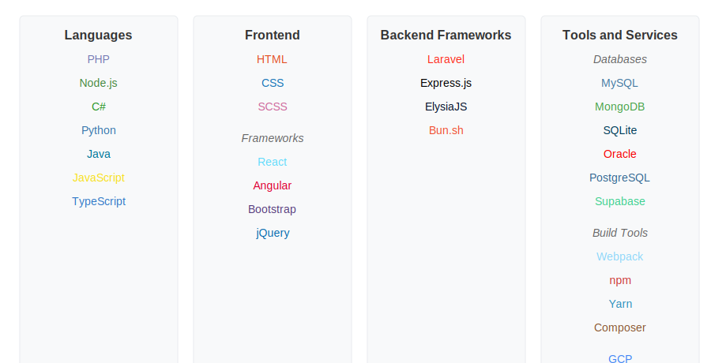

Luis has a background in both software and hardware development, but he chose to specialize in software engineering with a focus on product development and technical leadership.

In his most recent role, Luis served as a Senior Developer for an award-winning online job portal that connects non-executive job seekers to reliable employers in Singapore, Malaysia, and the Philippines.  [More info...](https://www.fastco.asia)

Luis' dream role is not only to develop products but also to understand the business and client needs, delivering solutions that add value. He believes that startups should have a clear purpose and vision, and that profit is a result of providing quality service.

# My Tech Stack

## 🚀 What I'm Up To
- Currently working with [Apptega](https://www.apptega.com/)
- Exploring AI technologies and integrating machine learning techniques into my projects
- Embracing the world of IoT as a hobby

## 🌐 Connect with Me
  

## 📈 GitHub Stats

## 📫 Let's Collaborate
I'm always open to collaboration and new opportunities. Feel free to reach out, and let's create something amazing together!
